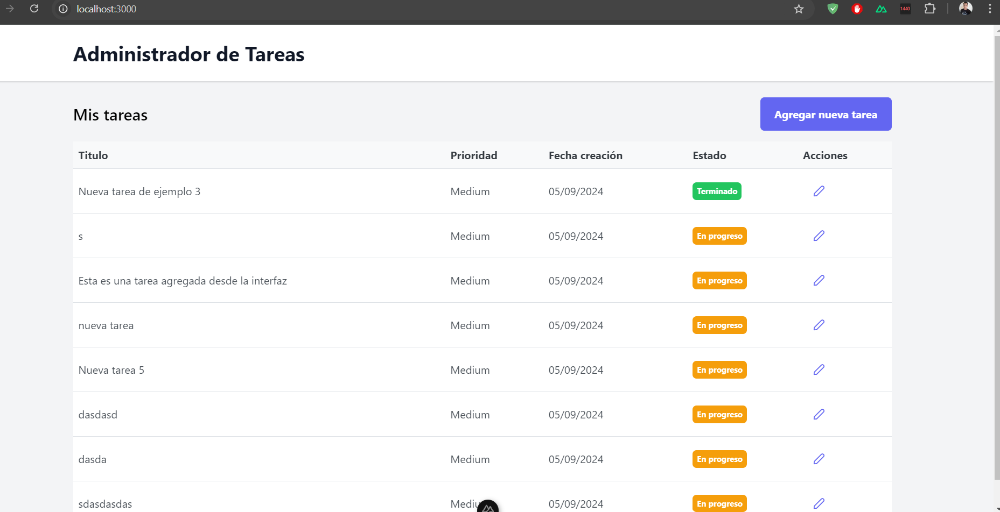

# Taskr - Aplicación de Gestión de Tareas

## Descripción

Taskr es una aplicación web moderna y eficiente para la gestión de tareas personales o de equipo. Desarrollada con Nuxt 3 en el frontend y una API RESTful en el backend, Taskr ofrece una interfaz intuitiva y responsive para crear, editar, y organizar tareas fácilmente.

## Características

- **Gestión de Tareas**: Crear, editar, y eliminar tareas.
- **Priorización**: Asignar prioridades a las tareas (Alta, Media, Baja).
- **Estados**: Seguimiento del estado de las tareas (Pendiente, En progreso, Terminado, Cancelado).
- **Fechas**: Asignación de fechas de creación y vencimiento a las tareas.
- **Filtrado**: Capacidad para filtrar tareas por estado.
- **Interfaz Responsiva**: Diseño adaptable para dispositivos móviles y de escritorio.
- **Integración API**: Comunicación en tiempo real con un backend para persistencia de datos.

## Tecnologías Utilizadas

### Frontend
- [Nuxt 3](https://nuxt.com/): Framework de Vue.js para aplicaciones web.
- [PrimeVue](https://primevue.org/): Biblioteca de componentes UI para Vue.js.
- [Tailwind CSS](https://tailwindcss.com/): Framework de CSS para diseño personalizado.

### Backend
- [Node.js](https://nodejs.org/): Entorno de ejecución para JavaScript.
- [Express](https://expressjs.com/): Framework web para Node.js.
- [MongoDB](https://www.mongodb.com/): Base de datos NoSQL para almacenamiento de tareas.

## Instalación

### Prerequisitos
- Node.js (v14 o superior)
- npm (v6 o superior)
- MongoDB

### Pasos de Instalación

1. Clonar el repositorio:
2. Instalar dependencias del frontend: npm install

